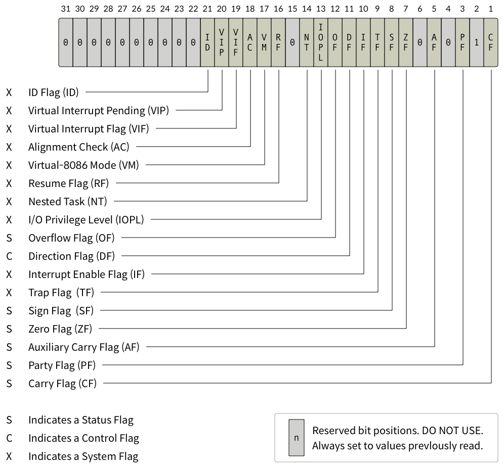

# Background : Computher Architecture

# Background : Computher Architecture

## 컴퓨터 구조와 명령어 집합 구조

### 컴퓨터 구조

폰 노이만 구조

- 중앙처리장치/기억장치/버스
- 중앙처리장치(CPU)
    - 프로세스 코드 로딩, 실행, 결과 저장
    - 산술논리장치 (ALU)
    - 제어장치
    - 레지스터
- 기억장치
    - 컴퓨터가 동작하는데 필요한 여러 데이터를 저장
    - 주기억장치
        - 프로그램 **실행과정에서 필요한 데이터들을 임시로 저장**
        - RAM
    - 보조기억장치
        - 운영체제, 프로그램과 같은 데이터를 **장기간 보관**
        - 하드 드라이브(HDD), SDD
    - 버스
        - 컴퓨터 부품과 부품 사이 신호 전송 통로
        - 데이터 버스/주소 버스/제어 버스

### 명령어 집합 구조(ISA)

정의 : CPU가 해석하는 명령어의 집합.

1. CISC
    1. 1970년대 나온 명령어 집합 구조. 당시엔 메모리 효율성에 초점을 맞춰 개발했음.
    2.  x86-64가 해당 명령어 집합 구조 사용.
2. RISC
    1. 1980년대 나온 명령어 집합 구조. CISC 구조 단점 해결 위해 개발. 저전력 기기에 적합하기 때문에 주로 모바일, 임베디드에 사용.
    2. ARM, MIPS 아키텍처 

## x86-64 아키텍처

정의 : x86 아키텍처와 호환되는 64비트 아키텍처

n비트 아키텍처란?

→ cpu가 한번에 처리할 수 있는 데이터의 크기. (WORD)

- 레지스터 크기 : 레지스터가 한번에 저장할 수 있는 데이터의 양
- ALU 연산 데이터 크기 : cpu의 산술논리장치에서 연산할 수 있는 데이터의 크기
- 표현 가능한 주소의 크기 : 메모리 상의 데이터를 가리키기 위해 사용할 수 있는 주소 범위, 즉 한번에 접근할 수 잇는 메모리 크기를 결정
- 버스의 대역폭 : 한 번에 전송할 수 있는 데이터의 양

WORD가 크면 유리한 점

→ 가상 메모리 크기가 큼, 소프트웨어적 한계 웬만해서는 X

## x86-64 : 레지스터

레지스터 :  cpu가 데이터를 빠르게 저장하고 사용할 때 이용하는 보관소

### 범용 레지스터

- 주로 데이터 연산
- but 범용이기 때문에 다양한 용도로 사용
- x86-64에서 8바이트까지 저장할 수 있으므로 부호없는 정수 기준 2의 64제곱 -1 만큼 저장 가능

| 레지스터 이름 | 의미 | 주용도 |
| --- | --- | --- |
| rax | Accumulator Register | 함수의 반환 값 |
| rbx | Base Register | x64에서는 주된 용도 없음 |
| rcx | Counter Register | 반복문의 반복 횟수, 각종 연산의 시행 횟수 |
| rdx | Data Register | x64에서는 주된 용도 없음 |
| rsi | Source index | 데이터 옮길 때 원본을 가리키는 포인터 |
| rdi | Destination Index | 데이터 옮길 때 목적지를 가리키는 포인터 |
| rsp  | Stack Pointer | 사용 중인 스택의 위치를 가리키는 포인터 |
| rdp | Stack Base Pointer | 스택의 바닥을 가리키는 포인터  |

### 세그먼트 레지스터

- x86 아키텍처에서 메모리를 세그먼트 단위로 접근하는 데 사용되는 특수한 레지스터

| 이름 | 주용도 |
| --- | --- |
| CS(Code Segment) | 실행할 코드의 시작 주소 |
| DS(Data Segment) | 프로그램에 지정된 데이터 영역의 시작 주소 |
| SS(Stack Segment) | 스택 영역의 시작 주소 |
| ES, FS, GS | 범용적인 용도로 사용  |

### 플래그 레지스터

- cpu가 연산을 수행한 후 결과의 상태를 저장하는 특수한 레지스터
- 특정 연산 후 조건을 판단하는 데 사용 → **분기(조건문), 인터럽트 등에 활용**
- x64 아키텍처에는 RFLAGS 8바이트 크기 플래그 레지스터 존재
    - 총 64개의 플래그 저장 가능

| 플래그 | 의미  |
| --- | --- |
| CF(Carry Flag) | 부호 없는 수의 연산 결과가 비트의 범위를 넘을 경우 설정된다. |
| ZF(Zero Flag) | 연산의 결과가 0일 경우 설정 |
| SF(Sign Flag) | 연산의 결과가 음수일 경우 설정 |
| OF(Overflow Flag) | 부호 있는 수의 연산 결과가 비트 범위를 넘을 경우 설정  |

### 레지스터 호환

---

# 퀴즈

### 퀴즈 1

rax랑 eax랑 똑같은 거 아님? 하다가 x86-64가 빅엔디안인가 리틀엔디안인가 하는 걸 사용한다는 게 기억이 나서 찾아봄.

조사 결과 리틀 엔디안이었다. 리틀 엔디안 방식은 가장 낮은 바이트부터 역순으로 데이터를 저장한다. 

예컨데 0x11223344라는 데이터가 있다면 리틀 엔디안은 이를 44332211순으로 저장함.  

따라서 답은 0xef/cd/ag/89

→ 그런데 이것도 오답이었음. 뭐지? 

그래서 rax/eax 레지스터 호환에 대해 다시 찾아보니, “EAX는 RAX 레지스터의 하위 32비트 부분을 나타냅니다. 즉, RAX 레지스터의 전체 64비트 중 앞의 32비트가 EAX로 사용됩니다.”라고 했다. 아…

<aside>
💡

EAX는 RAX 레지스터의 하위 32비트 부분을 나타낸다. 

</aside>

그럼 rax = **0x0123456789abcdef**라면 eax는 이의 하위 32비트 부분, 0x89abcdef

→ 정답.

### 퀴즈 2

ZF는 외우고 있음. (분기문에 많이 쓰여서.) 

ZF가 설정되었다면 연산 결과가 0 → 같은 값임. 

### 퀴즈3.

al??이 뭐더라… 하고 보니까 또 레지스터 호환 파트였음. 좀 제대로 볼 걸(ㅋㅋㅋ;) 아니 그래도 위의 호환 파트 다시 참고하자면, rax가 저거면 eax는 0x89abcdef 이고, al은 이 반인 cdef중 앞의 2비트인 것 같다. 

아니고… 뒤의 2비트네요. 

### 퀴즈4.

ah가 하위 4비트 중 앞의 2비트다…. 

### 퀴즈 5.

ax는 rax의 상위 4비트. 

엥 아니네; 

하위 4비트구나….